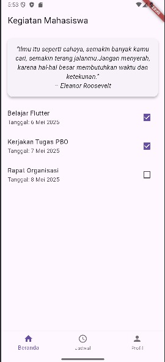
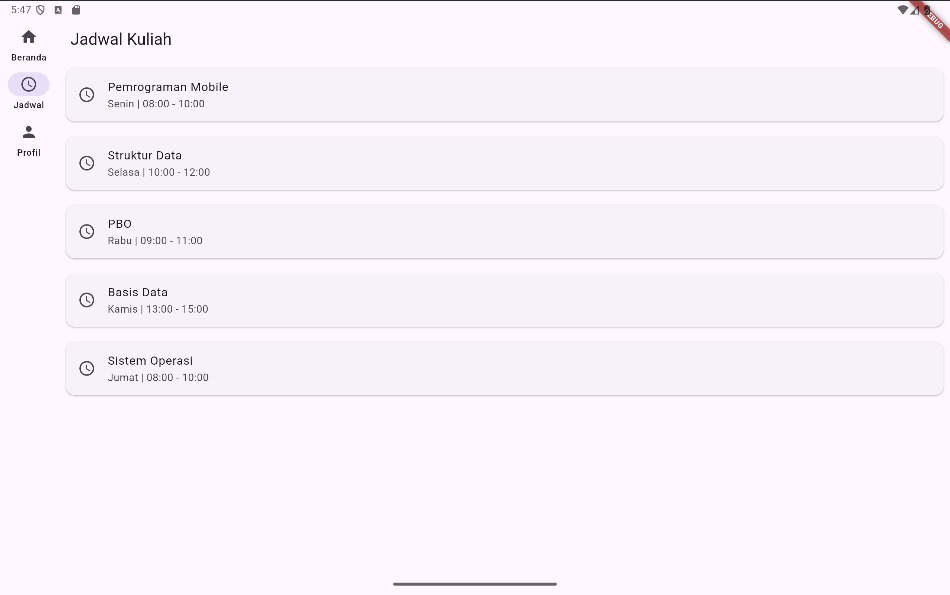
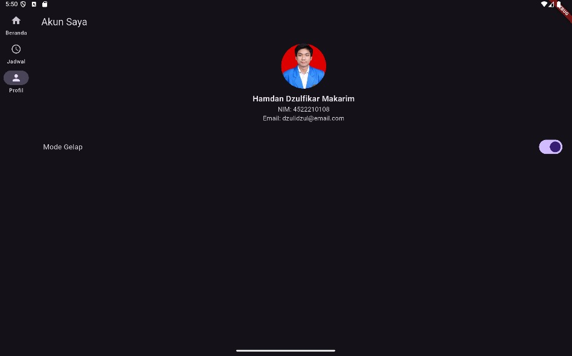

# Aplikasi Flutter Aplikasi Jadwal dan Kegiatan Mahasiswa : Navigasi 3 Halaman
1. Halaman Utama : Menampilkan kegiatan mahasiswa
2. Halaman Jadwal: Menampilkan jadwal perkuliahan
3. Halaman Profil: Menampilkan data pengguna

# Link Youtube 

# Halaman Utama
- Halaman ini menampilkan daftar kegiatan yang bisa ditandai selesai.
- menyisipkan quote motivasi di atas daftar kegiatan.

# Halaman Jadwal
- Halaman ini menampilkan jadwal mingguan dalam bentuk list.
- menampilkan waktu dan aktivitas harian dari Senin sampai Jumat.

# Halaman Profil
- Halaman ini menampilkan biodata pengguna termasuk foto, nama, nim, dan email.

## Screenshot Emulator:

## Penjelasan Program:
- Aplikasi Flutter ini merupakan aplikasi multi-halaman dengan desain adaptif untuk perangkat mobile dan tablet. Aplikasi terdiri dari tiga halaman utama: Home, Schedule, dan Profil, dengan tambahan fitur personalisasi seperti tema terang/gelap dan kutipan motivasi.  

## Fitur Tambahan
- **Tema (Light/Dark):**
Tema aplikasi dapat diubah oleh pengguna melalui switch pada halaman Profil, dan langsung diterapkan ke seluruh tampilan aplikasi.
- **Navigasi Adaptif:**
Menggunakan BottomNavigationBar untuk mobile dan NavigationRail untuk tablet, aplikasi otomatis menyesuaikan layout berdasarkan ukuran layar.
- **Quote (Kutipan Motivasi):**
Sebuah Card dengan teks kutipan ditampilkan di atas daftar kegiatan pada halaman Home, sebagai elemen personalisasi yang memberi semangat.

## Cara Menjalankan Aplikasi:
flutter pub get flutter run
